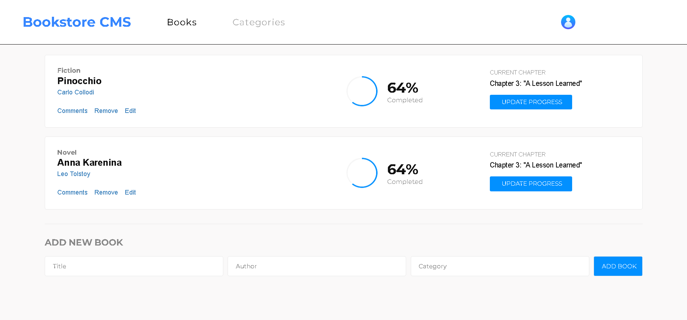

# Bookstore-React
Project Description

## Built With

- HTML
- CSS
- JavaSript/ES6
- React
- Linters
- NPM
- Webpack
- Babel

## Live Demo

[Netlify Live Demo Link](https://saidrasynl-bookstore-react.netlify.app/)

## Getting Started

To get a local copy up and running follow these simple example steps.

### Prerequisites

- Git/GitHub/VSCode/Linters/ES6/API/Webpack/Babel/Sass/NPM (Software Packages System)

### Setup

- Clone GitHub repository `gh repo clone SaidRasinlic/Bookstore-react`
- Install the devDependencies `npm install`
- Build the app `npm run build`
- Run the app `npm run start`

*Congratulations, enjoy the application! It should be on http://localhost:3000/*

## Authors

👤 **Said Rasinlic**

- GitHub: [@GitHub/SaidRasinlic](https://github.com/SaidRasinlic)
- Twitter: [@Twitter/SaidRasinlic](https://twitter.com/SaidRasinlic)
- LinkedIn: [@LinkedIn/SaidRasinlic](https://www.linkedin.com/in/SaidRasinlic)

## 🤝 Contributing

Contributions, issues, and feature requests are welcome!

Feel free to check the [issues page](../../issues/).

## Show your support

Give a ⭐️ if you like this project!

## Acknowledgments

- Microverse 

## 📝 License

This project is [MIT](LICENSE) licensed.
